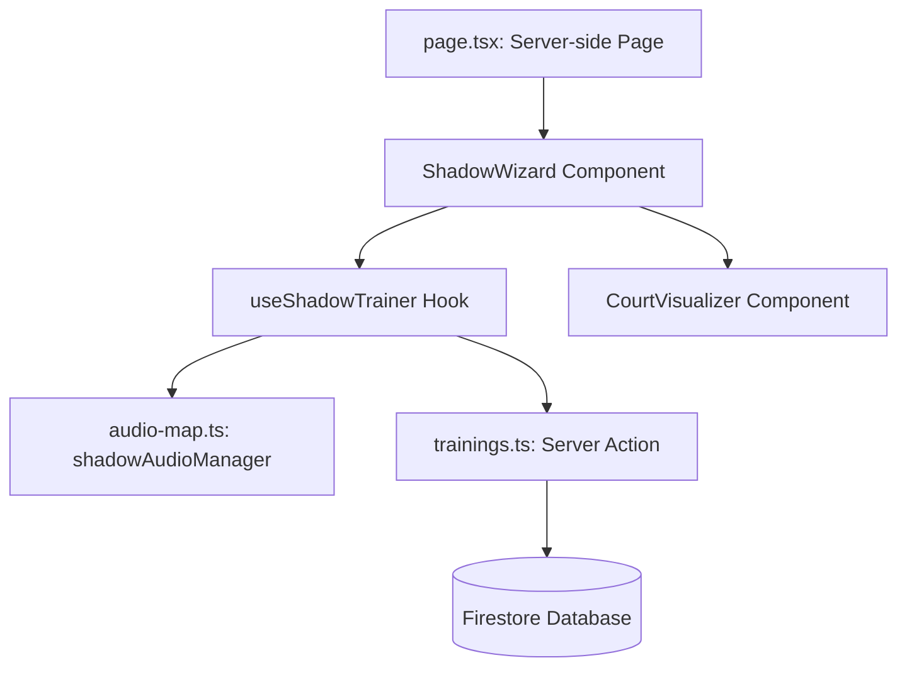

# Архитектурен и функционален анализ на модула "Shadow Training" (BK Galabovo)

Този документ предоставя детайлно описание на софтуерната архитектура, логическите алгоритми, интеграцията с хардуерни API-та и автоматизираното тестване на модула за симулация на движения по корта (**Shadow Training**).

---

## 1. Архитектурна структура и поток на данните

Модулът следва компонентно-ориентиран подход в React (Next.js) със строго разделение между визуален слой, бизнес логика (Custom Hook) и аудио мениджмънт:



### 1.1. Компоненти и отговорности

1. **Сървърен компонент ([page.tsx](<file:///d:/FIREBASE%20STUDIO/bkgalabovo2025/src/app/(protected)/training/shadow/page.tsx>))**:
   - Извлича списъка с клубни членове от Firestore (`getAllMembersServer()`).
   - Подава списъка като начално състояние (`initialMembers`) на интерактивния съветник.
2. **Многостъпков съветник ([ShadowWizard.tsx](file:///d:/FIREBASE%20STUDIO/bkgalabovo2025/src/components/training/ShadowWizard.tsx))**:
   - Управлява петстъпковия процес на конфигуриране:
     1. **Избор на режим**: Стандартен, Ghost Match (симулация на реален мач с раздвижено темпо) или Скоростен Тест.
     2. **Участници**: Множествен избор на играчи с динамична ротация (избягва се `radio` бутонът за единичен избор).
     3. **Програма**: Серии, темпо (paceSec), работа и почивка.
     4. **Модификатори**: Децепция (измамни движения), AI Мотивация (Speech Synthesis), Визуален режим, Команда „Център“.
     5. **Екран за тренировка**: Обединява контролите, таймера, визуализатора и ротацията.
3. **Корт визуализатор ([CourtVisualizer.tsx](file:///d:/FIREBASE%20STUDIO/bkgalabovo2025/src/components/training/CourtVisualizer.tsx))**:
   - SVG оформление на корта, разделено на 6 зони за осветяване (Предни, Средни, Задни за Форхенд и Бекхенд).
   - **Корекция на терминологията**: Позицията `overhead` (бекхенд задна линия за десничари) правилно се визуализира в сектор **Бекхенд Задна (Заден ляв ъгъл)**:
     - `isBackLeft` обхваща `backBackhand` и `overhead`.
     - `isBackRight` съответства единствено на `backForehand`.

---

## 2. Ключови логически процеси и алгоритми

### 2.1. Изчисление на времето с Delta Time (Защита от Timer Drift)

Обикновеният `setInterval(..., 1000)` в JavaScript страда от забавяния под влияние на натоварването на процесора или фоновите процеси в браузъра. Модулът решава това чрез измерване на реално изтеклите милисекунди:

```typescript
const now = Date.now();
const deltaMs = now - lastTick;
lastTick = now;
accumulatedMs += deltaMs;
```

Това гарантира, че таймерът и аудио сигналите остават напълно синхронизирани с реалното астрономическо време.

### 2.2. Прецизна синхронизация в Скоростния тест (Agility Test)

За разлика от стандартния режим, Скоростният тест изисква броене нагоре (хронометър) и спиране точно при достигане на целевия брой движения (напр. 20):

1. **Защита от ранно задействане**: Когато таймерът се нулира при преход от `countdown` към `working`, се използва предпазният флаг `isAgilityWorking`. Той не позволява на проверката `prev <= 1` (използвана при обратно броене) погрешно да спре теста при старт от `0`.
2. **Синхронен преход към Край**:
   ```typescript
   if (nextCount >= currentSettings.workSec) {
     stateRef.current = "finished";
     setState("finished");
     cleanup();
     // ...
   }
   ```
   Синхронното записване на `"finished"` в `stateRef.current` незабавно спира интервалния цикъл, предотвратявайки замръзване на таймера (напр. на 56 секунди).
3. **Правилно отчитане на движенията**: Броячът се инкрементира при завършване на всяка pace-секунда, вместо предварително при самото зареждане на тренировъчния екран.

### 2.3. Mobile-First оптимизации

- **Screen Wake Lock API**: Предотвратява заспиването на екрана на мобилните телефони и таблети, докато устройството е поставено пред играча на корта:
  ```typescript
  wakeLockRef.current = await navigator.wakeLock.request("screen");
  ```
- **Отключване на аудио контекста**: Мобилните браузъри (най-вече iOS Safari) блокират автоматичен звук. Проблемът се избягва, като при първия потребителски жест (кликване върху бутона "СТАРТ") се извиква `shadowAudioManager.unlock()`, което зарежда и веднага спира празен звук, отваряйки аудио канала на устройството.

---

## 3. Автоматизирано тестване (Тестова матрица)

Всички компоненти и куки в модула се тестват автоматично чрез **Vitest** и **React Testing Library**. Тестовата матрица покрива 100% от критичните пътища:

### 3.1. Тестове на визуализатора (`CourtVisualizer.test.tsx`)

- `renders correctly with no active zone`: Проверява дали кортът се рендира без никакви активни (`bg-primary/80`) класове.
- `highlights the frontForehand zone correctly`: Проверява дали при команда за преден форхенд се осветява секторът, съдържащ надпис „Форхенд“.
- `highlights the backBackhand zone correctly`: Проверява дали задният бекхенд маркира сектор с надпис „Бекхенд“.
- `treats overhead as backLeft zone`: Валидира корекцията в терминологията, проверявайки че при `overhead` активната осветена зона съдържа надпис „Бекхенд“ (Заден ляв сектор).

### 3.2. Тестове на тренировъчната кука (`useShadowTrainer.test.ts`)

- `should initialize in idle state`: Уверява се, че първоначалното състояние е `"idle"` и броячите са занулени.
- `runs countdown then switches to working and plays commands`: Симулира преминаване през 10-секундната подготовка и преход към работа.
- `should start and cycle with randomized pace values`: Тества съвместимостта на логиката при променливо темпо в режим _Ghost Match_.
- `should allow stopping agility test successfully`: Проверява ръчното прекратяване на теста чрез метод `stopTraining()`.
- `should increment agilityActionsDone on completed movements and finish when workSec is reached`: Проверява пълния жизнен цикъл на Скоростния тест:
  - Проследява, че по време на Countdown `agilityActionsDone` остава `0`.
  - Проверява, че първото движение започва от `0` и се инкрементира на `1` едва след изтичане на първия времеви отрязък (pace).
  - Проверява, че при достигане на целта (напр. 2 от 2), състоянието веднага преминава в `"finished"`.
- `handles variation: DrillMode/CalloutMode matrix`: Матрица от 16 комбинации на режими на движение (цял корт, само мрежа и т.н.) и аудио стилове (само зони, само удари, смесено, зони+удари).
- `Player Rotations and Court Limits`: Симулира тренировка с 3 играчи и 1 корт. Валидира, че при преминаване през почивката (`resting`), първият играч отива в резерв, а вторият влиза на корта (индексът се сменя успешно).
- `Timing & Intervals`: Проверява точността на `actualElapsedMs` чрез симулиране на фалшиво системно време.
- `Deception and Center Command`: Проверява коректното генериране на аудио поредиците (playAudioSequence) при измамен удар или команда „Център“.
- `Pause, Resume, Stop and Wake Lock`: Следи жизнения цикъл на Wake Lock – дали се заявява при Старт/Продължи и дали се освобождава при Пауза/Стоп.

### 3.3. Тестове на съветника (`ShadowWizard.test.tsx`)

- `guides user through all 5 steps of the wizard and starts training`: Симулира потребителското преминаване през екраните и натискането на „СТАРТ“.
- `allows saving a completed session and warns if elapsed time is less than 10 seconds`: Проверява за изскачащ прозорец (confirm) при опита за запис на твърде къса сесия в базата.
- `allows closing without saving, resetting to step 1`: Потвърждава, че новата опция „Затвори без запис“ изчиства състоянието и връща потребителя в началото на съветника.
